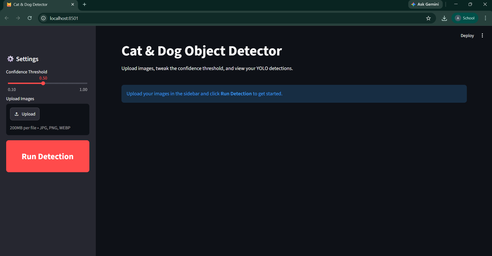
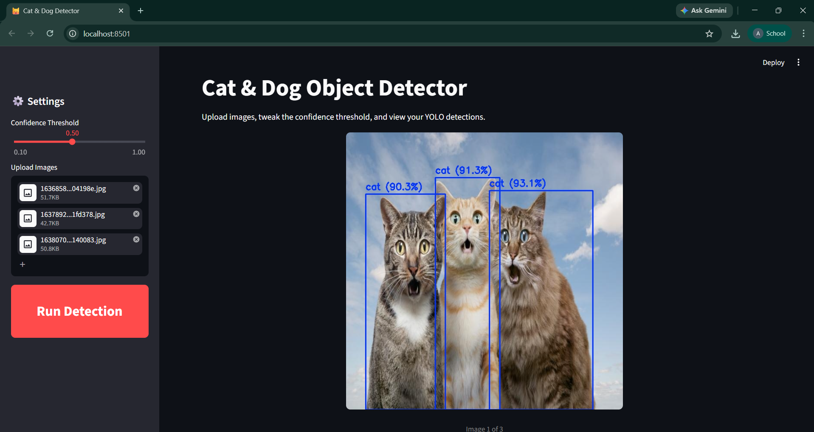
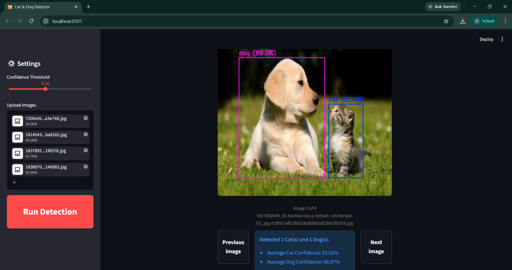

# Cat & Dog Object Detector

A Streamlit web application powered by YOLO for detecting cats and dogs in uploaded images.

## Project Structure

```text
Cat-Dog/
├── assets/                   # Screenshot images for README
│   ├── screenshot-home.png
│   ├── screenshot-result.png
│   └── screenshot-result2.png
├── dataset/                  # Dataset folder (used for local training)
│   ├── images/               # Image files (.jpg, .png, etc.)
│   │   ├── train/
│   │   └── val/
│   ├── labels/               # YOLO annotation files (.txt)
│   │   ├── train/
│   │   └── val/
│   └── data.yaml             # YOLO dataset configuration file
├── weights/
│   └── YoloCatDog.pt         # Trained model weights
├── main.py                   # Streamlit web application
├── train.py                  # Model training script
└── requirements.txt          # Python dependencies
```

## 📷 Screenshots

### Home Page


### Detection Outputs


